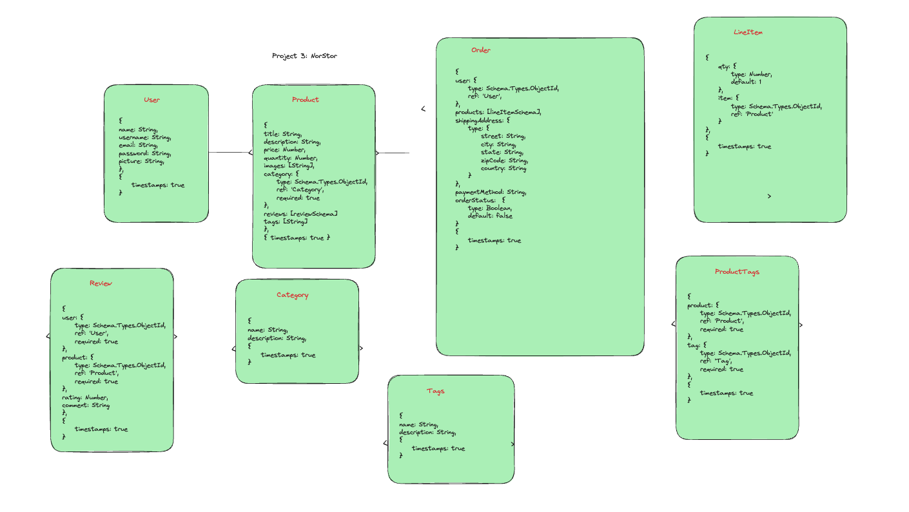
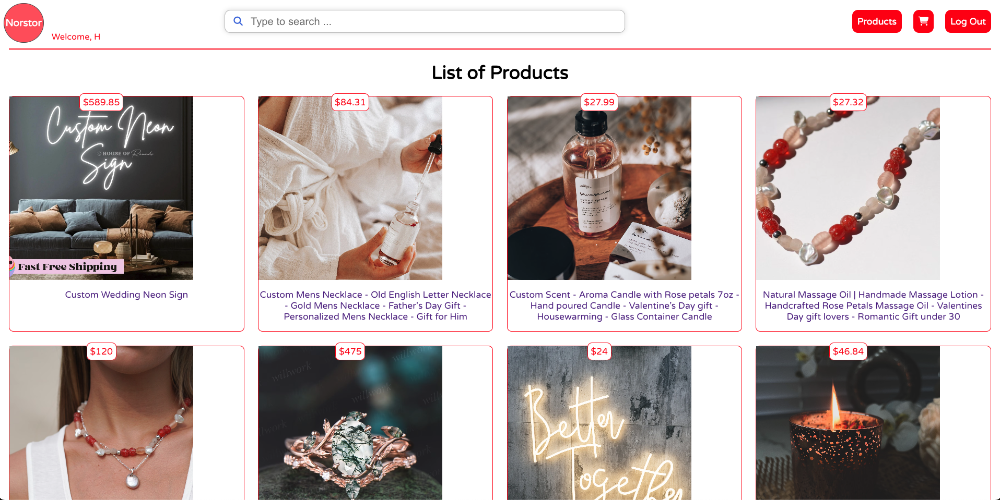

# Norstor 

## Table of Contents

- [Introduction](#Introduction)
- [Technologies Used](#Technologies-Used)
- [Features](#Features)
- [Installation](#Installation)
- [Future Icebox](#Future-Icebox)
- [Contributing](#Contribution)

## Introduction

Welcome to the NorStor repository. I have always been curious about people creating online business through i.e. Amazon, Shopify, Etsy etc. Never thought that I would be able to build a small one learning MERN stack (a tech-stack including MongoDB database, Express framework, React library, NodJs backend language). Here we are, I have started on this journey, and of course there is a lot ahead, but the starting has been fun. Hope you enjoyed visiting here 😀!

## Wireframe & ERD (Entity Relationship Diagram)


### [DEMO LIVE LINK](https://norstor-8be65c44ce4a.herokuapp.com/ "target=_blank")

## Technologies Used


<!--


 -->

## Features

- Search function: users can filter product listing via search text in the search bar 
- Cart feature: users can add product items on cart and change order quantities 
- Checkout feature: users can mimick checkout of the cart, but here you will see the order history instead of a entering a payment method option 

## Installation

To run the Stock Tracker App locally, follow these steps:

1. Clone the repository:

```html
git clone https://github.com/akyeshi/NorStor.git
```

2. Navigate to the project directory:

```html
cd NorStor
```

3. Install Node Module packages
```html
npm install 
```
4. Create build folder
```html
npm run build 
```

5. Start the Express server
```html
nodemon server.js 
```

6. Start the React frontend
```html
npm run start 
```


## Future Icebox

These are the feature on its way:

1. Stripe API gateway to take payment method 
2. Category filtering of products 
3. Add product feature, so users can become sellers on the platform
4. Add review feature, so users can add review to products

## Contributing

We welcome contributions to the Blackjack Game project. If you would like to contribute, please follow these steps:

1. Fork the repository.

2. Create a new branch for your feature or bug fix.

3. Make your changes and commit them.

4. Push your changes to your forked repository.

5. Submit a pull request to the main repository.
